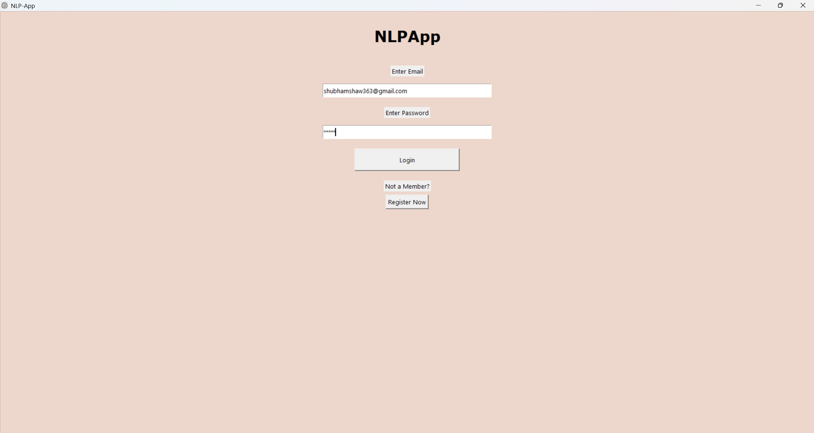

# 🧠 NLP-App: Intelligent Text Analysis Desktop App

NLP-App is a desktop application built using **Tkinter (Python GUI)** that provides real-time **Sentiment Analysis**, **Emotion Detection**, and **Named Entity Recognition (NER)** using pre-trained **Hugging Face Transformers** models via API.

[NLP App UI](resources/) 

---

## 🚀 Features

- 🔐 **User Authentication** (Registration/Login)
- ✨ **Sentiment Analysis** (Positive/Negative)
- ❤️ **Emotion Detection** (joy, sadness, anger, love, etc.)
- 🧠 **Named Entity Recognition** (Names, Locations, Organizations, etc.)
- 📦 Simple and beautiful **Tkinter-based GUI**
- 🖥️ Packaged into a standalone `.exe` using **PyInstaller**
- 🔐 Secure API token handling via `.env`

---

## 📸 Screenshots

| Registration Screen | Login Screen | Types of features | Sentiment Analysis | Emotion Detection | NER |
|--------------|--------------------|-------------------|--------------|--------------------|-------------------|
|  |  |  |  |  |  |  | 


Watch the full demo on YouTube:

[](https://www.youtube.com/watch?v=oIR_j7iW2aA)

## 🛠️ Tech Stack

- **Frontend:** Python (Tkinter)
- **Backend:** Hugging Face Inference API
- **Packaging:** PyInstaller
- **Database:** Local JSON file (`db.json`)
- **Environment Config:** `python-dotenv`

---

## ⚙️ Installation & Setup

### 🔧 Requirements
- Python 3.10+
- `pip install -r requirements.txt`

### 📁 Clone Repo

```bash
git clone https://github.com/your-username/NLP-App.git
cd NLP-App
